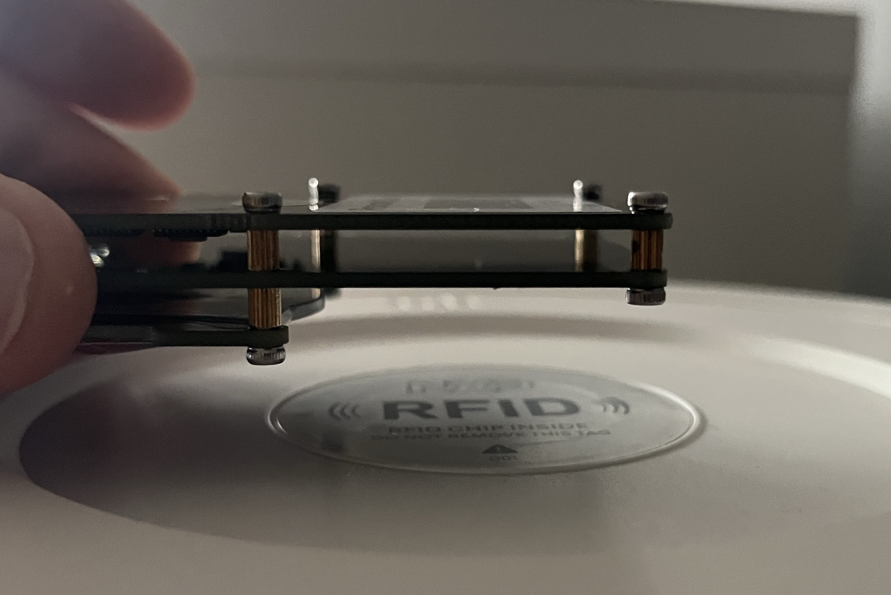

This procedure resets filter on Xiaomi Air Purifiers

## Prerequisites

* Proxmark3 hw + sw (command `pm3` must be available)
* Python

## Automatic procedure

1. Position your proxmark3 device with hf antenna centered and around 1,5-2 cm above NXP RFID logo on the bottom of the filter:



2. Run `python3 ./autopwn.py` (you can add `-v` if you are curious what is happening)

3. Wait for success message

```
INFO: checking if proxmark3 software is installed
INFO: checking if proxmark3 is connected...
INFO: proxmark3 found
INFO: scanning for filter tags...
INFO: UID found: 048968B2BA6C80
INFO: calculated password: 086FDB8A
INFO: setting block 8 to '00 00 00 00'...
INFO: reading block 8 to verify...
INFO: SUCCESS! Filter life has been restored
```


## Manual procedure

1. sh: `pm3`
2. pm3: `hf search`

```
 🕙  Searching for ISO14443-A tag...          
[=] ---------- ISO14443-A Information ----------
[+]  UID: 04 89 68 B2 BA 6C 80   ( double )  <== THIS UID 
[+] ATQA: 00 44
[+]  SAK: 00 [2]
[+] MANUFACTURER: NXP Semiconductors Germany
[+] Possible types:
[+]    MIFARE Ultralight
[+]    MIFARE Ultralight C
[+]    MIFARE Ultralight EV1
[+]    MIFARE Ultralight Nano
[+]    MIFARE Ultralight AES
[+]    MIFARE Hospitality
[+]    NTAG 2xx
[=] proprietary non iso14443-4 card found, RATS not supported
[=] 
```

3. sh: `python3 ./getpwd.py 048968B2BA6C80`

```
PWD: 086FDB8A
```

4. pm3: `hf mfu rdbl -b 8 -k 086FDB8A` - should be non-zero, i.e.:

```
[=] Using pwd 08 6F DB 8A 

[=] Block#  | Data        | Ascii
[=] -----------------------------
[=] 08/0x08 | C8 75 04 01 | �u..
```

5. pm3: `hf mfu wrbl -b 8 --data 00000000 -k 086FDB8A` - write 8 zeroes

```
[=] Block: 8 (0x08) [ 00 00 00 00 ]
[=] Using pwd 08 6F DB 8A 
[+] Write ( ok )
[?] Try `hf mfu rdbl -b 8` to verify 
```

6. pm3: `hf mfu rdbl -b 8 -k 086FDB8A` - should be **zero**, i.e.:

```
[=] Using pwd 08 6F DB 8A 

[=] Block#  | Data        | Ascii
[=] -----------------------------
[=] 08/0x08 | 00 00 00 00 | ....
```

7. Filter is now at 100%